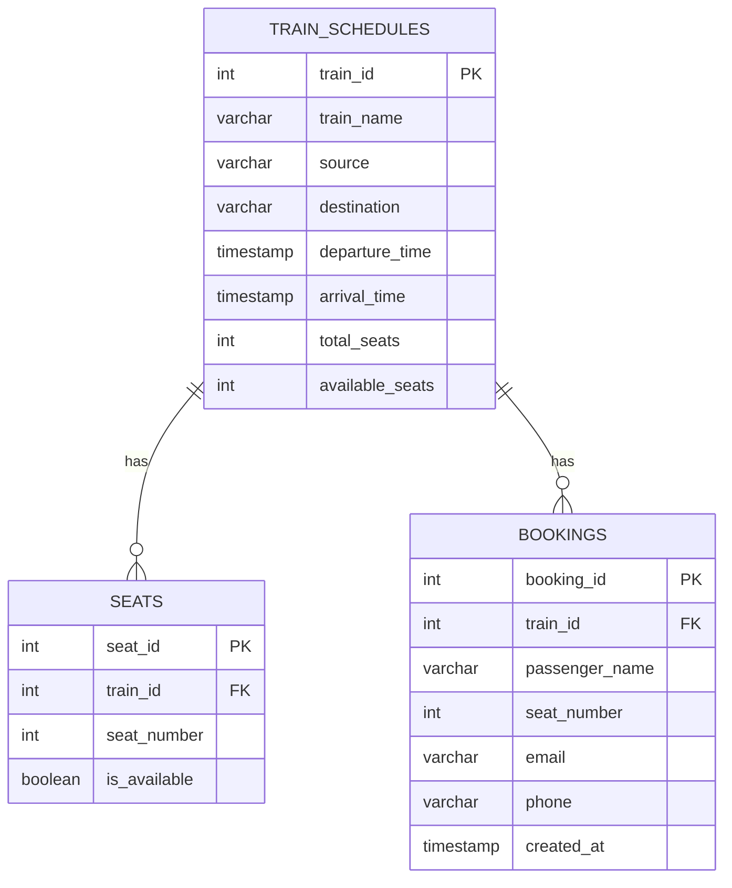
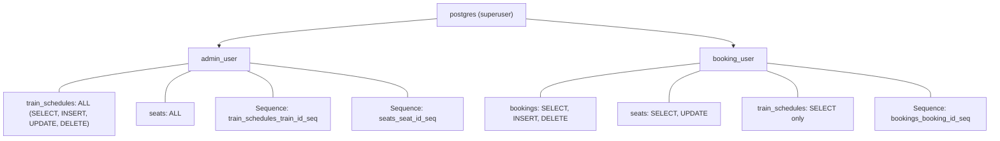
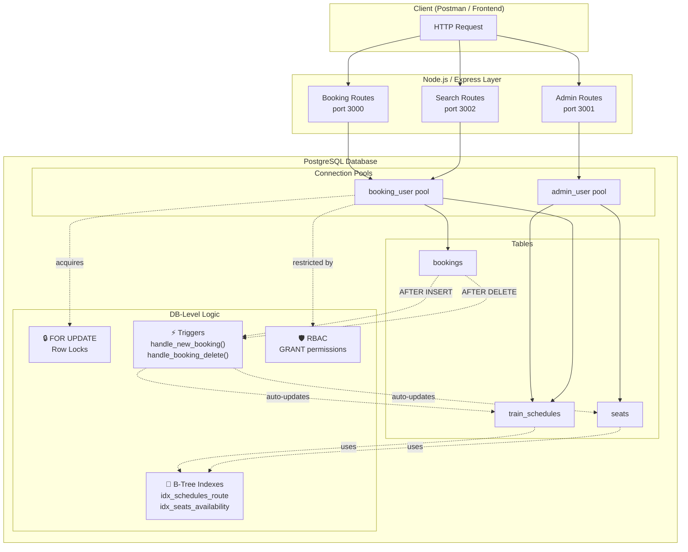

# Railway Booking Application — Implementation Walkthrough

A detailed, code-backed explanation of each key engineering decision in your project.

---

## 1. Scalable REST API for Train Schedules, Reservations & Seat Availability

> *"Developed a scalable REST API to manage high-volume train schedules, user reservations, and dynamic seat availability"*

### Architecture

The application is a **Node.js / Express** backend connected to a **PostgreSQL** database. It exposes RESTful endpoints across three logical services:

| Service | File | Port | Purpose |
|---|---|---|---|
| Booking Service | [`server.js`](file:///c:/Users/Dhanashyam/Desktop/railway-booking-application-/server.js) | 3000 | Create, view, and cancel bookings |
| Admin Service | [`admin.js`](file:///c:/Users/Dhanashyam/Desktop/railway-booking-application-/admin.js) | 3001 | Add and view train schedules |
| Search Service | [`server_searching.js`](file:///c:/Users/Dhanashyam/Desktop/railway-booking-application-/server_searching.js) | 3002 | Search trains by source & destination |

### Database Schema (3 relational tables)



### Key API Endpoints

| Method | Endpoint | What it does |
|---|---|---|
| `POST` | `/api/bookings` | Books a seat (with concurrency-safe locking) |
| `GET` | `/api/bookings` | Lists all bookings, newest first |
| `DELETE` | `/api/bookings/:id` | Cancels a booking and frees the seat |
| `POST` | `/api/admin/trains` | Adds a new train + auto-generates all seat records |
| `GET` | `/api/admin/trains` | Lists all train schedules |
| `GET` | `/api/trains/search?source=X&destination=Y` | Searches trains on a route |

### Dynamic Seat Availability

Seat availability is tracked at **two levels** simultaneously:
1. **Individual seat level** — the `seats.is_available` boolean column (per-seat granularity)
2. **Aggregate level** — the `train_schedules.available_seats` counter (fast overview)

Both are kept in sync automatically (via triggers — explained in Point 3 below).

### Scalability via Connection Pooling

The `pg.Pool` client is used instead of single connections. This maintains a **pool of reusable database connections**, avoiding the overhead of creating a new TCP connection for every request:

```javascript
const pool = new Pool({
    user: 'booking_user',
    host: 'localhost',
    database: 'railway_booking',
    password: 'securepassword123',
    port: 5432,
});
```

---

## 2. Solving Race Conditions with ACID Transactions & Row-Level Locking

> *"Solved race conditions under heavy load by implementing ACID transactions and Row-Level Locking"*

### The Problem: Double Booking

When two users try to book **the same seat** simultaneously, a classic race condition occurs:

```
Timeline                 User 1                    User 2
────────    ──────────────────────    ──────────────────────
  t₁        CHECK seat → available    
  t₂                                  CHECK seat → available  ← STALE READ!
  t₃        BOOK seat ✓                
  t₄                                  BOOK seat ✓  ← DOUBLE BOOKING!
```

Without protection, both users see the seat as available and both bookings succeed — a **data integrity violation**.

### The Solution: `FOR UPDATE` Row-Level Locking

This is demonstrated in [`double_booking_fix.js`](file:///c:/Users/Dhanashyam/Desktop/railway-booking-application-/double_booking_fix.js), which simulates two concurrent users via **two separate connection pools**:

```javascript
// User 1 locks the row — no one else can read this row FOR UPDATE until User 1 commits/rollbacks
const seat1 = await client1.query(
    'SELECT * FROM seats WHERE train_id = 1 AND seat_number = 1 AND is_available = true FOR UPDATE'
);
```

#### How it works step by step:

```
Timeline                 User 1                              User 2
────────    ──────────────────────────────    ──────────────────────────────
  t₁        BEGIN transaction                 BEGIN transaction
  t₂        SELECT ... FOR UPDATE             
             → Row is LOCKED ✓                
  t₃        Seat is available → BOOK it       SELECT ... FOR UPDATE
                                               → BLOCKED (waiting for lock)
  t₄        COMMIT (lock released)            
  t₅                                          Lock acquired, reads row
                                               → is_available = false
                                               → "Seat already booked" ✗
```

> [!IMPORTANT]
> `FOR UPDATE` acquires an **exclusive row-level lock**. Other transactions attempting `SELECT ... FOR UPDATE` on the same row will **block and wait** until the first transaction commits or rolls back. This is PostgreSQL's pessimistic locking mechanism.

### ACID Transaction Boundaries

Every booking and cancellation is wrapped in explicit transaction boundaries:

```javascript
await client.query('BEGIN');       // ← Atomicity starts here

// ... all SQL operations ...

await client.query('COMMIT');      // ← All succeed together
```

With a `catch` block that guarantees rollback:

```javascript
catch (err) {
    await client.query('ROLLBACK'); // ← All fail together (no partial state)
    throw err;
}
```

This ensures the **four ACID properties**:

| Property | How it's enforced |
|---|---|
| **Atomicity** | `BEGIN` / `COMMIT` / `ROLLBACK` — all operations succeed or none do |
| **Consistency** | Foreign keys, unique constraints (`seats_train_id_seat_number_key`), and triggers keep data valid |
| **Isolation** | `FOR UPDATE` locks prevent concurrent reads of the same row from producing stale data |
| **Durability** | PostgreSQL's WAL (Write-Ahead Logging) ensures committed data survives crashes |

---

## 3. PostgreSQL Triggers & Stored Procedures for Automated Sync

> *"Added complex sets of business logic functions within the database itself utilizing PostgreSQL Triggers and Stored Procedures"*

### The Evolution: Before vs. After Triggers

This is best seen by comparing [`server.js`](file:///c:/Users/Dhanashyam/Desktop/railway-booking-application-/server.js) (before triggers) with [`server_after_trigger`](file:///c:/Users/Dhanashyam/Desktop/railway-booking-application-/server_after_trigger) (after triggers).

#### BEFORE Triggers — [`server.js`](file:///c:/Users/Dhanashyam/Desktop/railway-booking-application-/server.js)

The application code had to manually execute **3 SQL statements** per booking:

```javascript
// 1. Insert the booking
const booking = await client.query(
    'INSERT INTO bookings (...) VALUES (...) RETURNING *', [...]
);
// 2. Manually update seat availability
await client.query(
    'UPDATE seats SET is_available = false WHERE train_id = $1 AND seat_number = $2', [...]
);
// 3. Manually decrement available_seats counter
await client.query(
    'UPDATE train_schedules SET available_seats = available_seats - 1 WHERE train_id = $1', [...]
);
```

**3 round trips** from Node.js → PostgreSQL → Node.js per booking. Same for cancellation.

#### AFTER Triggers — [`server_after_trigger`](file:///c:/Users/Dhanashyam/Desktop/railway-booking-application-/server_after_trigger)

The application code only executes **1 SQL statement**:

```javascript
// Only insert the booking – the trigger handles the rest!
const booking = await client.query(
    'INSERT INTO bookings (...) VALUES (...) RETURNING *', [...]
);
```

The database **automatically** handles the cascading updates.

### The Stored Procedures (PL/pgSQL Functions)

Defined in [`railway_db_dump.sql`](file:///c:/Users/Dhanashyam/Desktop/railway-booking-application-/railway_db_dump.sql):

#### `handle_new_booking()` — Fires AFTER INSERT on bookings

```sql
CREATE FUNCTION public.handle_new_booking() RETURNS trigger
    LANGUAGE plpgsql
AS $$
BEGIN
    -- Mark the individual seat as unavailable
    UPDATE seats SET is_available = false 
    WHERE train_id = NEW.train_id AND seat_number = NEW.seat_number;
    
    -- Decrement the aggregate available_seats counter
    UPDATE train_schedules SET available_seats = available_seats - 1 
    WHERE train_id = NEW.train_id;
    
    RETURN NEW;
END;
$$;
```

#### `handle_booking_delete()` — Fires AFTER DELETE on bookings

```sql
CREATE FUNCTION public.handle_booking_delete() RETURNS trigger
    LANGUAGE plpgsql
AS $$
BEGIN
    -- Re-open the seat
    UPDATE seats SET is_available = true 
    WHERE train_id = OLD.train_id AND seat_number = OLD.seat_number;
    
    -- Increment the aggregate counter
    UPDATE train_schedules SET available_seats = available_seats + 1 
    WHERE train_id = OLD.train_id;
    
    RETURN OLD;
END;
$$;
```

#### Trigger Bindings

```sql
CREATE TRIGGER after_new_booking 
    AFTER INSERT ON public.bookings 
    FOR EACH ROW EXECUTE FUNCTION public.handle_new_booking();

CREATE TRIGGER after_booking_delete 
    AFTER DELETE ON public.bookings 
    FOR EACH ROW EXECUTE FUNCTION public.handle_booking_delete();
```

### Why this reduces network latency

```
BEFORE TRIGGERS (server.js)                AFTER TRIGGERS (server_after_trigger)
─────────────────────────                  ──────────────────────────────────────
  App ──INSERT──→ DB ──result──→ App         App ──INSERT──→ DB
  App ──UPDATE──→ DB ──result──→ App                         ├─ trigger: UPDATE seats
  App ──UPDATE──→ DB ──result──→ App                         └─ trigger: UPDATE train_schedules
                                                        ──result──→ App
  
  3 network round trips                     1 network round trip
```

> [!TIP]
> The trigger-based updates execute **inside the same transaction** at the database level with zero network overhead. The `NEW` and `OLD` pseudo-records give the trigger direct access to the inserted/deleted row data.

---

## 4. B-Tree Indexes & Database-Level RBAC

> *"Optimized train schedule search queries from O(N) to O(log N) complexity using B-Tree indexes, and added RBAC"*

### B-Tree Indexes

Two custom indexes are defined in the SQL dump:

#### 1. Route Search Index

```sql
CREATE INDEX idx_schedules_route 
    ON public.train_schedules USING btree (source, destination);
```

This is a **composite B-Tree index** on `(source, destination)`. It directly accelerates the search query in [`server_searching.js`](file:///c:/Users/Dhanashyam/Desktop/railway-booking-application-/server_searching.js):

```sql
SELECT ... FROM train_schedules 
WHERE source = $1 AND destination = $2 
ORDER BY departure_time;
```

**Without the index**: PostgreSQL performs a **sequential scan** — reads every row in `train_schedules` to find matches → **O(N)**.

**With the B-Tree index**: PostgreSQL performs an **index scan** — traverses the balanced tree to find matching rows → **O(log N)**.

```
                    [Delhi-Mumbai | Chennai-Bangalore]
                   /                                  \
    [Chennai-Bangalore]                        [Delhi-Mumbai]
         /        \                              /         \
   [leaf nodes with                       [leaf nodes with
    row pointers]                          row pointers]
```

#### 2. Seat Availability Index

```sql
CREATE INDEX idx_seats_availability 
    ON public.seats USING btree (train_id, is_available);
```

This speeds up the seat-check query used during booking:

```sql
SELECT * FROM seats WHERE train_id = $1 AND seat_number = $2 AND is_available = true FOR UPDATE
```

### Database-Level Role-Based Access Control (RBAC)

Demonstrated in [`server_with _security.js`](file:///c:/Users/Dhanashyam/Desktop/railway-booking-application-/server_with%20_security.js), there are **two PostgreSQL roles** with different privilege levels:

#### Role Definitions (from SQL dump)



#### Exact GRANT Statements

| Role | Table | Permissions |
|---|---|---|
| `booking_user` | `bookings` | `SELECT`, `INSERT`, `DELETE` |
| `booking_user` | `seats` | `SELECT`, `UPDATE` |
| `booking_user` | `train_schedules` | `SELECT` only |
| `admin_user` | `train_schedules` | `ALL` (full control) |
| `admin_user` | `seats` | `ALL` (full control) |

#### Security Enforcement in Code

Two **separate connection pools** enforce role separation at the application level:

```javascript
// Admin operations use admin credentials
const adminPool = new Pool({ user: 'admin_user', ... });

// Booking operations use restricted credentials
const bookingPool = new Pool({ user: 'booking_user', ... });
```

#### Security Test Endpoint

The [`/api/test-security`](file:///c:/Users/Dhanashyam/Desktop/railway-booking-application-/server_with%20_security.js#L76-L89) endpoint proves RBAC works by attempting an unauthorized operation:

```javascript
// booking_user tries to INSERT into train_schedules → DENIED by PostgreSQL
app.post('/api/test-security', async (req, res) => {
    try {
        await bookingPool.query(
            `INSERT INTO train_schedules (...) VALUES (...)`
        );
        res.json({ message: 'Insert succeeded — SECURITY BREACH!' });
    } catch (err) {
        // PostgreSQL returns: "permission denied for table train_schedules"
        res.status(403).json({
            message: 'Permission denied — RBAC is working!',
            error: err.message,
        });
    }
});
```

> [!IMPORTANT]
> This is **database-level** security, not application-level middleware. Even if someone bypasses the Express server entirely and connects directly to PostgreSQL with `booking_user` credentials, they **still cannot** modify train schedules. The enforcement lives in the database kernel itself.

---

## Summary: How Everything Connects


