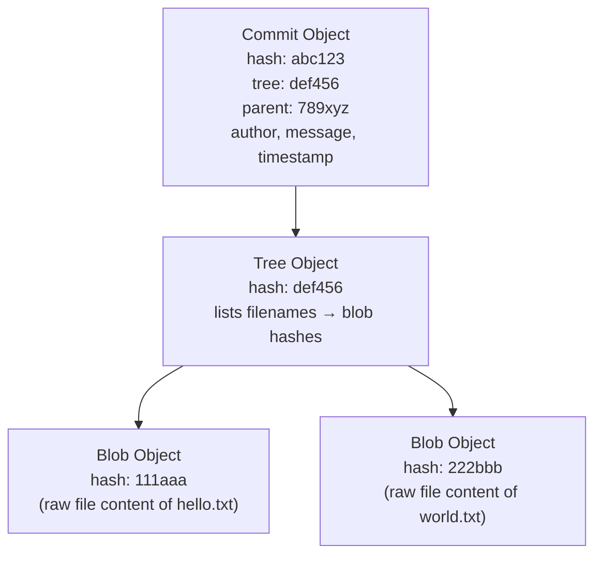
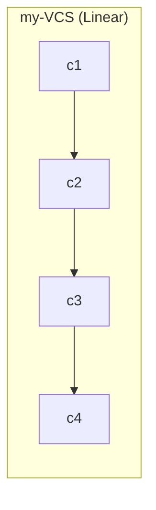
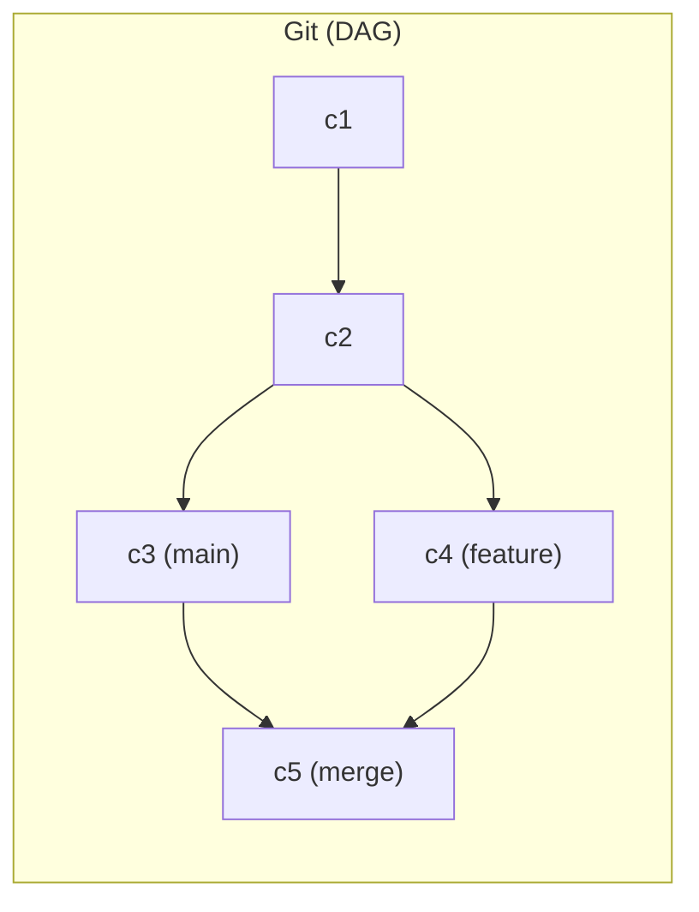
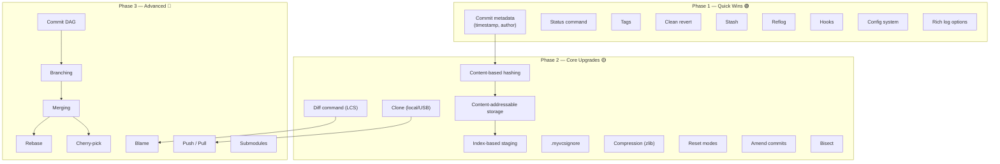

# my-VCS vs Git — Every Difference & How to Bridge Them

---

## Category 1: Storage & Object Model

### 1.1 Content-Addressable Storage vs File Copies

| | Git | my-VCS |
|--|-----|--------|
| **What** | Every piece of data (file content, directory listing, commit) is stored as an **object** identified by a SHA-1 hash of its content | Files are **fully copied** into `.myvcs/commits/<hash>/` |
| **Why it matters** | If two files have identical content, Git stores them **once**. Your VCS stores **duplicate copies** |

**Git's object types:**


**Implementation idea:**
- Create an `objects/` directory inside `.myvcs/`
- When adding a file, compute SHA-256 of its content → that becomes the filename in `objects/`
- Store a **tree file** per commit that maps `filename → content hash`
- Before writing an object, check if it already exists (deduplication for free)

---

### 1.2 Compression

| | Git | my-VCS |
|--|-----|--------|
| **What** | Objects are compressed with **zlib**. Multiple objects get packed into **pack files** using delta compression | Files stored as raw, uncompressed copies |
| **Why it matters** | A 100-commit Git repo can be smaller than a 5-commit my-VCS repo |

**Implementation idea:**
- Use zlib (available in C++) to compress each object file before writing it to disk
- On read, decompress it
- For delta compression: store the first version of a file fully, and subsequent versions as "diff from previous" — this is much more advanced

---

### 1.3 The Index (Staging Area Internals)

| | Git | my-VCS |
|--|-----|--------|
| **What** | Git's staging area is a single binary file (`.git/index`) that records a **list of tracked files** with their hashes, permissions, and timestamps | my-VCS copies entire files into `.myvcs/staging/` |
| **Why it matters** | Git's index is tiny (just metadata). Your staging area doubles the disk space of every staged file |

**Implementation idea:**
- Instead of copying files into `staging/`, maintain a `staging_index.txt` file that lists which files (and their content hashes) should be included in the next commit
- Format: `<content-hash> <filepath>`
- The actual content already lives in `objects/` (from 1.1), so no duplication needed

---

## Category 2: Commit & History

### 2.1 Content-Based Hash vs Random Hash

| | Git | my-VCS |
|--|-----|--------|
| **What** | Hash is SHA-1 of `commit content + tree + parent + author + timestamp` — **deterministic** | Hash is 8 random hex chars via [`generateHash()`](file:///c:/Users/Dhanashyam/Desktop/my-VCS/vcs.cpp#L12-L22) |
| **Why it matters** | Git can detect corruption (hash won't match content). Identical commits always produce the same hash. Random hashes can theoretically collide |

**Implementation idea:**
- Hash the concatenation of: tree content + parent hash + commit message + timestamp
- Use SHA-256 from OpenSSL or a header-only library like PicoSHA2
- Truncate to 16 hex chars for readability if you want

---

### 2.2 Commit Metadata

| | Git | my-VCS |
|--|-----|--------|
| **What** | Stores: author name, author email, committer name, committer email, timestamp, parent hash(es), tree hash, message | Stores only: hash, message (in [`commit_node`](file:///c:/Users/Dhanashyam/Desktop/my-VCS/Commit_list.h#L14-L20)) |
| **Why it matters** | You can't tell when, by whom, or what the parent of a commit was |

**Implementation idea:**
- Add fields to `commit_node`: `timestamp`, `author`, `parent_hash`
- Read author from a config file (`.myvcs/config`) or environment variable
- Auto-generate timestamp with `std::time()` + `std::put_time()`
- Store `parent_hash` as the hash of the previous commit (or empty for the first commit)

---

### 2.3 Commit Graph (DAG) vs Linear List

| | Git | my-VCS |
|--|-----|--------|
| **What** | Commits form a **Directed Acyclic Graph** — a commit can have 0 parents (initial), 1 parent (normal), or 2+ parents (merge) | Commits form a simple **singly linked list** via [`commit_list`](file:///c:/Users/Dhanashyam/Desktop/my-VCS/Commit_list.h#L22-L79) |
| **Why it matters** | A linked list can't represent branches diverging and merging back |





**Implementation idea:**
- Replace the linked list with a `std::unordered_map<string, commit_node>` keyed by hash
- Each `commit_node` stores a `vector<string> parent_hashes` instead of a `next` pointer
- Traversal becomes graph traversal (BFS/DFS) instead of pointer chasing

---

### 2.4 Amend / Edit Commits

| | Git | my-VCS |
|--|-----|--------|
| **What** | `git commit --amend` lets you modify the last commit (change message, add files) | No ability to modify any commit once created |

**Implementation idea:**
- For amend: delete the latest commit folder, re-create it with the updated staging + old files, generate a new hash, update history
- Since your hash is random anyway, the new hash doesn't cause issues — but with content-based hashing, the hash would naturally change

---

## Category 3: Branching & Merging

### 3.1 Branches

| | Git | my-VCS |
|--|-----|--------|
| **What** | A branch is a lightweight pointer (a file containing a commit hash) stored in `.git/refs/heads/<branch-name>`. Creating a branch is instant — it's just writing 40 bytes to a file | No concept of branches. History is one single line |
| **Why it matters** | Can't work on multiple features in parallel |

**Implementation idea:**
- Create a `refs/` directory inside `.myvcs/` with one file per branch
- Each file contains a single line: the commit hash that branch points to
- Store the current branch name in `.myvcs/HEAD`
- `branch <name>`: create a new file in `refs/` pointing to the current commit
- `checkout <name>`: update HEAD, then revert working directory to that branch's commit
- On `commit`: update the current branch's ref file to point to the new commit

---

### 3.2 Merging

| | Git | my-VCS |
|--|-----|--------|
| **What** | Git supports fast-forward merge, 3-way merge (using the common ancestor), recursive merge, octopus merge. It detects conflicts at the line level and inserts conflict markers | No merging at all |

**Implementation idea (simplest 2-way merge):**
- Compare files from both branches
- If a file exists in only one branch → include it
- If a file exists in both with the same content → include it
- If a file exists in both with **different content** → write both versions into the file with conflict markers (`<<<<<<`, `======`, `>>>>>>`) and let the user resolve manually

**Idea for proper 3-way merge (what Git does):**
- Find the **Lowest Common Ancestor (LCA)** commit of both branches by walking parent pointers
- For each file, compare three versions: ancestor, branch A, branch B
- If only one side changed a line → take that change
- If both sides changed the same line differently → conflict

---

### 3.3 Rebase

| | Git | my-VCS |
|--|-----|--------|
| **What** | `git rebase main` replays your branch's commits one-by-one on top of `main`, creating a clean linear history | No rebase |

**Implementation idea:**
- Walk from the current branch tip back to the point where it diverged from the target branch
- Collect those commits in order
- For each commit, compute the "diff" it introduced, then apply that diff on top of the target branch's latest commit
- Create new commits (with new hashes since parent changes) for each replayed commit

---

### 3.4 Cherry-Pick

| | Git | my-VCS |
|--|-----|--------|
| **What** | `git cherry-pick <hash>` takes a single commit from anywhere and applies it to the current branch | No cherry-pick |

**Implementation idea:**
- Compute the diff between commit `<hash>` and its parent
- Apply that diff to the current working directory
- Create a new commit with the same message

---

### 3.5 Tags

| | Git | my-VCS |
|--|-----|--------|
| **What** | Lightweight tags (a named pointer to a commit) and annotated tags (a full object with message, author, date) | No tagging |

**Implementation idea:**
- Create a `tags/` directory inside `.myvcs/`
- Each file is named after the tag and contains the commit hash
- For annotated tags, store extra metadata (tagger, date, message) in the file

---

## Category 4: Collaboration & Distribution

### 4.1 Distributed Architecture

| | Git | my-VCS |
|--|-----|--------|
| **What** | Every clone is a **full copy** of the entire repository including all history. There's no central server — any copy can serve as the "source of truth" | Purely local. The `.myvcs/` folder exists only on your machine |
| **Why it matters** | If your disk dies, everything is lost. No collaboration possible |

**Implementation idea:**
- `clone <path>`: Copy the entire `.myvcs/` directory from another location (could be a network path, USB drive, or SSH target)
- Use `std::filesystem::copy` with `recursive` — you already know how to do this

---

### 4.2 Remote Repositories (Push / Pull / Fetch)

| | Git | my-VCS |
|--|-----|--------|
| **What** | Git communicates with remotes over HTTP, SSH, or Git protocol. `push` sends your commits, `pull` fetches and merges, `fetch` just downloads | No remote support |

**Implementation idea (simplest version using shared filesystem):**
- Store a "remote" path in `.myvcs/config` (e.g., a network drive or shared folder)
- `push`: Copy all commit folders that the remote doesn't have yet → update the remote's branch refs
- `pull`: Copy all commit folders from the remote that you don't have → merge the remote branch into yours
- For real network support, you'd need sockets or HTTP — much more complex

---

### 4.3 Pull Requests / Code Review

| | Git | my-VCS |
|--|-----|--------|
| **What** | Not part of Git itself, but enabled by GitHub/GitLab through branch comparison and review workflows | No concept |

**Implementation idea:**
- This is really a UI/platform feature, not a VCS feature
- If you built a web interface for your VCS, you could show the diff between two branches and allow comments

---

## Category 5: Inspection & Debugging

### 5.1 Diff

| | Git | my-VCS |
|--|-----|--------|
| **What** | `git diff` shows line-by-line changes between working directory, staging, and any commits. Uses Myers diff algorithm (LCS-based) | No diff capability |

**Implementation idea:**
- Read both versions of a file line-by-line into two `vector<string>`
- Implement the **Longest Common Subsequence (LCS)** algorithm (dynamic programming, O(n×m) time)
- Lines in file A but not in LCS → deletions (`-`)
- Lines in file B but not in LCS → additions (`+`)

---

### 5.2 Blame / Annotate

| | Git | my-VCS |
|--|-----|--------|
| **What** | `git blame <file>` shows which commit last modified each line of a file | No blame |

**Implementation idea:**
- For each line in the current version of a file, walk backwards through commit history
- Find the earliest commit where that line appeared
- Display: `<hash> <author> <line content>`
- Requires having diff capability (5.1) first

---

### 5.3 Bisect

| | Git | my-VCS |
|--|-----|--------|
| **What** | `git bisect` does a binary search through commit history to find which commit introduced a bug | No bisect |

**Implementation idea:**
- User marks a "good" commit and a "bad" commit
- Binary search: check out the middle commit, ask user "good or bad?"
- Narrow the range and repeat until the offending commit is found
- Requires: linear commit ordering + revert capability (you already have revert)

---

### 5.4 Rich Log (Graph, Filters, Formatting)

| | Git | my-VCS |
|--|-----|--------|
| **What** | `git log --oneline --graph --all --author=X --since=2024-01-01` — filterable, formatted, graphical | [`printlog()`](file:///c:/Users/Dhanashyam/Desktop/my-VCS/Commit_list.h#L47-L57) just prints `hash | message` linearly |

**Implementation idea:**
- Add flags: `log --oneline`, `log -n 5` (last 5), `log --author=X`
- Parse `argc/argv` for these options
- For graph display (with branches), print ASCII art showing branch lines — requires the DAG structure from 2.3

---

### 5.5 Status Command

| | Git | my-VCS |
|--|-----|--------|
| **What** | `git status` shows staged files, modified files, untracked files in a clear summary | No status command |

**Implementation idea:**
- Compare staging area vs empty → list staged files
- Compare working directory vs latest commit → list modified and untracked files
- Use `fs::file_size()` or content hashing for quick change detection

---

## Category 6: Safety & Recovery

### 6.1 Stash

| | Git | my-VCS |
|--|-----|--------|
| **What** | `git stash` temporarily saves uncommitted changes and reverts to a clean state. `git stash pop` restores them | No stash |

**Implementation idea:**
- Create a `.myvcs/stash/` directory
- `stash`: copy all modified files (diff from latest commit) into `stash/<timestamp>/`, then revert working directory to the latest commit
- `stash pop`: copy stashed files back into the working directory, delete the stash entry

---

### 6.2 Reflog

| | Git | my-VCS |
|--|-----|--------|
| **What** | Git records **every** change to HEAD and branch tips in a reflog. Even "lost" commits (after reset, rebase) can be recovered for 30–90 days | No reflog. If you lose a hash, that commit is effectively invisible |

**Implementation idea:**
- Maintain a `.myvcs/reflog.txt` append-only file
- Every time HEAD or a branch pointer changes, log: `<timestamp> <old-hash> → <new-hash> <action description>`
- This becomes a recovery tool — the commit folders still exist on disk even if the linked list doesn't reference them

---

### 6.3 Reset (Soft / Mixed / Hard)

| | Git | my-VCS |
|--|-----|--------|
| **What** | `git reset --soft` moves HEAD but keeps staged changes. `--mixed` unstages but keeps working directory. `--hard` throws away everything | Only has full revert (equivalent to `--hard` only) via [`revert()`](file:///c:/Users/Dhanashyam/Desktop/my-VCS/vcs.cpp#L77-L96) |

**Implementation idea:**
- `reset --soft <hash>`: Only update the branch pointer / linked list to point at `<hash>`. Don't touch staging or working directory
- `reset --mixed <hash>`: Update branch pointer + clear staging area. Don't touch working directory
- `reset --hard <hash>`: Update branch pointer + clear staging + overwrite working directory (your current revert)

---

### 6.4 Clean Revert (Untracked Files)

| | Git | my-VCS |
|--|-----|--------|
| **What** | `git checkout` / `git restore` replaces working directory files. `git clean -fd` removes untracked files | Revert only overwrites tracked files — untracked files survive |

**Implementation idea:**
- Before restoring from a commit, delete all files in the working directory (except `.myvcs/` and the executable)
- Then copy the commit's snapshot — results in an exact match

---

## Category 7: Configuration & Extensibility

### 7.1 `.gitignore`

| | Git | my-VCS |
|--|-----|--------|
| **What** | Glob patterns to exclude files from tracking (build artifacts, IDE files, etc.) | No ignore mechanism |

**Implementation idea:**
- Read `.myvcsignore` line by line on startup
- Before adding any file, check it against the patterns
- Support basic patterns: `*.exe`, `build/`, `*.o`, `!important.exe` (negation)

---

### 7.2 Hooks

| | Git | my-VCS |
|--|-----|--------|
| **What** | Scripts in `.git/hooks/` that run automatically at certain events: `pre-commit`, `post-commit`, `pre-push`, etc. | No hooks |

**Implementation idea:**
- Before `commit()`, check if `.myvcs/hooks/pre-commit` exists
- If it does, run it with `std::system()` or `popen()`
- If it returns non-zero exit code, abort the commit
- Same pattern for `post-commit`, `pre-revert`, etc.

---

### 7.3 Config System

| | Git | my-VCS |
|--|-----|--------|
| **What** | Three levels: system (`/etc/gitconfig`), global (`~/.gitconfig`), local (`.git/config`). Stores user name, email, aliases, editor, etc. | No config system |

**Implementation idea:**
- Create `.myvcs/config` as an INI-style text file:
  ```
  [user]
  name = Dhanashyam
  email = dhan@example.com
  ```
- Parse it at startup with simple string splitting
- Use the values when creating commit metadata

---

### 7.4 Submodules

| | Git | my-VCS |
|--|-----|--------|
| **What** | Embed one Git repository inside another as a dependency at a specific commit | No submodules |

**Implementation idea:**
- Store a `.myvcsmodules` file listing: `<path> <remote-location> <commit-hash>`
- On init/clone, recursively initialize each submodule at its pinned commit

---

## Complete Feature Gap Summary

| # | Feature | Git | my-VCS | Difficulty |
|---|---------|-----|--------|-----------|
| 1.1 | Content-addressable storage | ✅ | ❌ | 🟡 |
| 1.2 | Compression | ✅ | ❌ | 🟡 |
| 1.3 | Index-based staging | ✅ | ❌ Copies files | 🟡 |
| 2.1 | Content-based hash | ✅ SHA-1 | ❌ Random | 🟡 |
| 2.2 | Commit metadata | ✅ Full | ❌ Hash+msg only | 🟢 |
| 2.3 | Commit DAG | ✅ | ❌ Linked list | 🔴 |
| 2.4 | Amend commits | ✅ | ❌ | 🟡 |
| 3.1 | Branches | ✅ | ❌ | 🔴 |
| 3.2 | Merging | ✅ | ❌ | 🔴 |
| 3.3 | Rebase | ✅ | ❌ | 🔴 |
| 3.4 | Cherry-pick | ✅ | ❌ | 🔴 |
| 3.5 | Tags | ✅ | ❌ | 🟢 |
| 4.1 | Distributed | ✅ | ❌ Local only | 🟡 |
| 4.2 | Push / Pull | ✅ | ❌ | 🔴 |
| 5.1 | Diff | ✅ | ❌ | 🟡 |
| 5.2 | Blame | ✅ | ❌ | 🔴 |
| 5.3 | Bisect | ✅ | ❌ | 🟡 |
| 5.4 | Rich log | ✅ | ❌ Basic | 🟢 |
| 5.5 | Status | ✅ | ❌ | 🟢 |
| 6.1 | Stash | ✅ | ❌ | 🟢 |
| 6.2 | Reflog | ✅ | ❌ | 🟢 |
| 6.3 | Reset modes | ✅ 3 modes | ❌ Hard only | 🟡 |
| 6.4 | Clean revert | ✅ | ❌ Partial | 🟢 |
| 7.1 | .gitignore | ✅ | ❌ | 🟡 |
| 7.2 | Hooks | ✅ | ❌ | 🟢 |
| 7.3 | Config | ✅ | ❌ | 🟢 |
| 7.4 | Submodules | ✅ | ❌ | 🔴 |

---

## Recommended Implementation Roadmap



> [!TIP]
> **Phase 1** features can each be implemented in under 50 lines of code. Start here for the highest reward-to-effort ratio. **Phase 2** requires understanding algorithms (hashing, LCS, compression). **Phase 3** requires restructuring your core data model from a linked list to a DAG.
