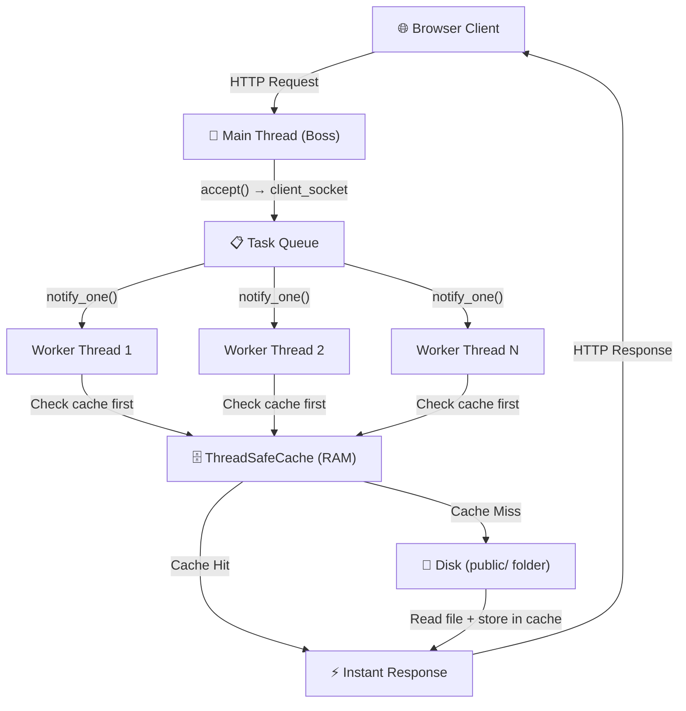
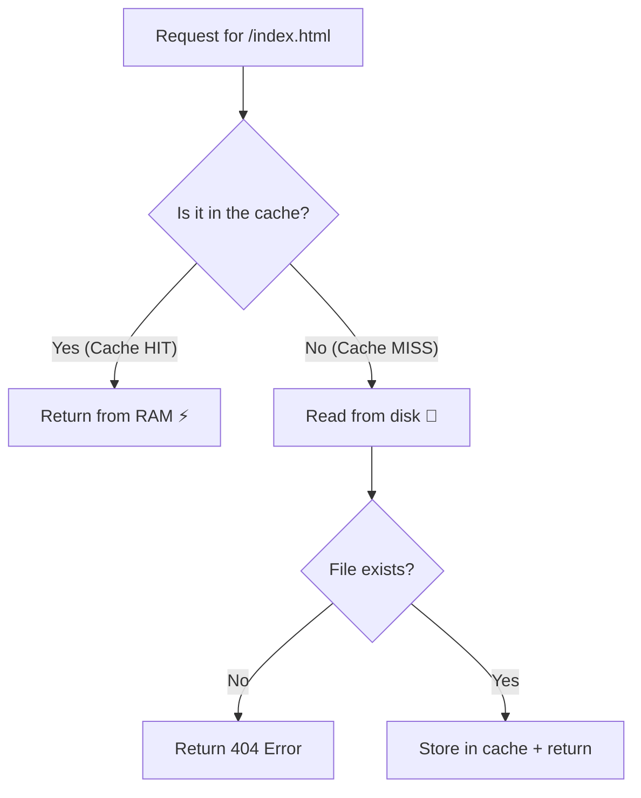

# Multithreaded C++ HTTP Server — Complete Project Explanation

## Project Overview

This is a **multithreaded HTTP web server** written in C++17. It demonstrates three core **Operating System concepts**:

| OS Concept | Where it's used | Purpose |
|---|---|---|
| **Thread Pool** (Multithreading) | [`threadpool.hpp`](file:///c:/Users/Dhanashyam/Desktop/os_project/threadpool.hpp) | Handle many clients concurrently without creating/destroying threads per request |
| **Readers-Writer Lock** (Synchronization) | [`thread_safe_cache.hpp`](file:///c:/Users/Dhanashyam/Desktop/os_project/thread_safe_cache.hpp) | Allow safe concurrent access to a shared in-memory cache |
| **POSIX Sockets** (IPC / Networking) | [`server.cpp`](file:///c:/Users/Dhanashyam/Desktop/os_project/server.cpp) | Create, bind, listen, and accept TCP connections |

### Architecture



---

## File 1: [`Makefile`](file:///c:/Users/Dhanashyam/Desktop/os_project/Makefile) — Build Configuration

This file tells the `make` tool how to compile the project.

```makefile
# Compiler configuration
CXX = g++
```
**Line 2**: Sets the C++ compiler to `g++` (the GNU C++ compiler).

```makefile
# We MUST use c++17 for the shared_mutex, and -pthread for multithreading
CXXFLAGS = -std=c++17 -pthread -Wall -O2
```
**Line 4**: Compiler flags:
| Flag | Meaning |
|---|---|
| `-std=c++17` | Use C++17 standard. **Required** because `shared_mutex` and `optional` are C++17 features |
| `-pthread` | Link the POSIX threads library. **Required** for `std::thread`, `std::mutex`, etc. |
| `-Wall` | Enable all common compiler warnings |
| `-O2` | Optimization level 2 — makes the binary faster |

```makefile
# Output binary name
TARGET = server
```
**Line 7**: The compiled executable will be named `server`.

```makefile
# Source files
SRCS = server.cpp
```
**Line 10**: Only `server.cpp` is listed as a source file. The `.hpp` files are pulled in via `#include` directives.

```makefile
all: $(TARGET)

$(TARGET): $(SRCS)
	$(CXX) $(CXXFLAGS) -o $(TARGET) $(SRCS)
```
**Lines 12–15**: The default `all` target builds the `server` binary. The actual compilation command expands to:
```
g++ -std=c++17 -pthread -Wall -O2 -o server server.cpp
```

```makefile
clean:
	rm -f $(TARGET)
```
**Lines 17–18**: `make clean` deletes the compiled binary.

---

## File 2: [`threadpool.hpp`](file:///c:/Users/Dhanashyam/Desktop/os_project/threadpool.hpp) — Thread Pool Implementation

This is the **core OS concept** file. It implements the **Producer-Consumer pattern** using threads, a mutex, and a condition variable.

### Header Guard & Includes (Lines 2–8)

```cpp
#pragma once
```
**Line 2**: Prevents this header from being included multiple times in the same compilation unit.

```cpp
#include <vector>             // To store worker threads
#include <queue>              // The task queue (FIFO)
#include <thread>             // std::thread — OS thread creation
#include <mutex>              // std::mutex — mutual exclusion lock
#include <condition_variable> // For worker threads to sleep/wake
#include <functional>         // std::function — type-erased callable wrapper
```
**Lines 3–8**: Each include brings in one piece of the thread pool machinery.

### Private Members (Lines 13–19)

```cpp
class ThreadPool {
private:
    vector<thread> workers;              // The actual OS threads
    queue<function<void()>> tasks;       // Queue of pending tasks (callable objects)
    
    mutex queue_mutex;                   // Protects the task queue from race conditions
    condition_variable condition;        // Used to wake up sleeping workers
    bool stop;                           // Flag to signal shutdown
```

| Member | Type | Purpose |
|---|---|---|
| `workers` | `vector<thread>` | Stores handles to all worker threads created at startup |
| `tasks` | `queue<function<void()>>` | A FIFO queue of "jobs" — each job is a function that takes no arguments and returns nothing |
| `queue_mutex` | `mutex` | Ensures only one thread accesses the `tasks` queue at a time |
| `condition` | `condition_variable` | Allows worker threads to **sleep** when there's no work and **wake up** when work arrives |
| `stop` | `bool` | When set to `true`, signals all workers to exit their infinite loops |

### Constructor — Spawning Worker Threads (Lines 22–42)

```cpp
ThreadPool(size_t num_threads) : stop(false) {
```
**Line 22**: Constructor takes the number of threads to create. Initializes `stop` to `false`.

```cpp
    for(size_t i = 0; i < num_threads; ++i) {
        workers.emplace_back([this] {
```
**Lines 24–25**: Creates `num_threads` OS threads. Each thread runs the lambda function defined inside.

```cpp
            for(;;) {
                function<void()> task;
                {
                    unique_lock<mutex> lock(this->queue_mutex);
                    this->condition.wait(lock, [this]{ return this->stop || !this->tasks.empty(); });
```
**Lines 26–31 — The Worker Loop (this is the heart of the thread pool)**:
1. `for(;;)` — Infinite loop. Each worker lives forever (until `stop` is set).
2. `function<void()> task` — Local variable to hold the task this worker will execute.
3. `unique_lock<mutex> lock(...)` — Locks the `queue_mutex`. Only one worker can access the queue at a time.
4. `condition.wait(lock, predicate)` — **This is the key OS concept**:
   - The worker thread **releases the lock** and **goes to sleep** (blocked by the OS scheduler).
   - It wakes up **only when** `condition.notify_one()` is called **AND** the predicate is true (i.e., either `stop == true` or the queue is not empty).
   - This avoids **busy-waiting** (spinning in a loop wasting CPU).

```cpp
                    if(this->stop && this->tasks.empty()) return;
```
**Line 33**: If shutdown was requested AND there are no remaining tasks, the worker exits its loop (thread terminates).

```cpp
                    task = move(this->tasks.front());
                    this->tasks.pop();
                }
                task();
```
**Lines 35–39**:
- `move(tasks.front())` — Takes the front task from the queue using **move semantics** (efficient, no copy).
- `tasks.pop()` — Removes it from the queue.
- The `}` on line 37 **releases the mutex lock** (the `unique_lock` destructor runs), so other workers can access the queue.
- `task()` — **Executes the task** (in this project, it calls `handle_client()`).

### `enqueue()` — Adding Tasks (Lines 46–52)

```cpp
void enqueue(function<void()> task) {
    {
        unique_lock<mutex> lock(queue_mutex);
        tasks.emplace(move(task));
    }
    condition.notify_one();
}
```
**This is what the Boss (main) thread calls.** It:
1. Locks the mutex.
2. Pushes the new task onto the queue.
3. Releases the lock (the `}` on line 50).
4. Calls `notify_one()` — wakes up **exactly one** sleeping worker thread.

### Destructor — Graceful Shutdown (Lines 54–63)

```cpp
~ThreadPool() {
    {
        unique_lock<mutex> lock(queue_mutex);
        stop = true;
    }
    condition.notify_all();
    for(thread &worker: workers) {
        worker.join();
    }
}
```
1. Sets `stop = true` under the lock.
2. `notify_all()` — Wakes up **all** sleeping workers so they can see `stop == true`.
3. `join()` — The main thread **blocks** until each worker thread finishes execution. This prevents the program from terminating while threads are still running.

---

## File 3: [`thread_safe_cache.hpp`](file:///c:/Users/Dhanashyam/Desktop/os_project/thread_safe_cache.hpp) — Thread-Safe In-Memory Cache

This implements a **Readers-Writer Lock** pattern using C++17's `shared_mutex`.

### Header Guard & Includes (Lines 1–5)

```cpp
#pragma once
#include <string>
#include <unordered_map>     // Hash map for O(1) lookups
#include <shared_mutex>      // C++17 readers-writer lock
#include <optional>          // C++17 — a value that may or may not exist
```

### Private Members (Lines 10–15)

```cpp
class ThreadSafeCache {
private:
    unordered_map<string, string> cache;  // filename → file content
    mutable shared_mutex rw_lock;         // The readers-writer lock
```

| Member | Purpose |
|---|---|
| `cache` | An `unordered_map` (hash table) mapping file paths (e.g., `"/index.html"`) to their contents |
| `rw_lock` | A `shared_mutex`. `mutable` allows it to be locked even inside `const` methods |

### `getFile()` — Read Operation (Lines 18–29)

```cpp
optional<string> getFile(const string& filename) const {
    shared_lock<shared_mutex> read_lock(rw_lock);
    
    auto it = cache.find(filename);
    if (it != cache.end()) {
        return it->second;  // Cache Hit!
    }
    
    return nullopt;  // Cache Miss!
}
```

**This is the FAST PATH.** Key details:

- `shared_lock<shared_mutex>` — Acquires a **read lock (shared lock)**.
  - **Multiple threads** can hold this lock at the same time → concurrent reads are fast.
  - A read lock only blocks if a writer is currently holding the lock.
- `optional<string>` — Returns the file content if found, or `nullopt` if not.
- `cache.find()` — O(1) average-case hash table lookup.

### `saveFile()` — Write Operation (Lines 31–36)

```cpp
void saveFile(const string& filename, const string& file_content) {
    unique_lock<shared_mutex> write_lock(rw_lock);
    cache[filename] = file_content;
}
```

**This is the SLOW PATH.** Key details:

- `unique_lock<shared_mutex>` — Acquires an **exclusive write lock**.
  - **Only ONE thread** can hold this at a time.
  - It blocks **all readers and all other writers** until the write is done.
- `cache[filename] = file_content` — Inserts or overwrites the entry.

> [!IMPORTANT]
> **Why Readers-Writer Lock instead of a regular mutex?**
> A regular `mutex` would block **all** threads even during reads. Since most cache accesses are reads (after the first request caches a file), the `shared_mutex` allows all those reads to happen **concurrently**, dramatically improving throughput.

---

## File 4: [`server.cpp`](file:///c:/Users/Dhanashyam/Desktop/os_project/server.cpp) — Main Server Logic

### Includes (Lines 1–12)

```cpp
#include <iostream>          // cout, cerr
#include <string>            // std::string
#include <cstring>           // C-style string functions (memset, etc.)
#include <unistd.h>          // POSIX: read(), close()
#include <sys/socket.h>      // POSIX: socket(), bind(), listen(), accept(), send()
#include <netinet/in.h>      // sockaddr_in, htons(), INADDR_ANY
#include <fstream>           // ifstream for reading files
#include <sstream>           // stringstream for buffering file content

#include "threadpool.hpp"
#include "thread_safe_cache.hpp"
```

Lines 4–6 are **POSIX system headers** — these are Linux/Unix system calls for networking.

### Global State (Lines 16–19)

```cpp
const int PORT = 8080;
ThreadSafeCache fileCache;
```
- `PORT` — The server listens on port 8080.
- `fileCache` — A **single global instance** of the thread-safe cache, shared across all worker threads.

### `readFileFromDisk()` — Disk I/O Helper (Lines 22–30)

```cpp
string readFileFromDisk(const string& filepath) {
    ifstream file("public" + filepath);
    if (!file.is_open()) return "";
    
    stringstream buffer;
    buffer << file.rdbuf();
    return buffer.str();
}
```

| Line | What it does |
|---|---|
| 24 | Opens the file at `public/` + the requested path (e.g., `public/index.html`) |
| 25 | If the file doesn't exist, returns an empty string (will trigger a 404) |
| 27–28 | Reads the **entire file** into a `stringstream` buffer in one shot using `rdbuf()` |
| 29 | Returns the file content as a `string` |

### `handle_client()` — The Worker Thread Function (Lines 33–79)

This is the function each **worker thread** executes for every incoming HTTP request.

```cpp
void handle_client(int client_socket) {
    char buffer[4096] = {0};
    read(client_socket, buffer, 4096);
```
**Lines 33–35**: 
- Takes the client socket (file descriptor) as input.
- Creates a 4096-byte buffer initialized to zeros.
- `read()` — **POSIX system call**. Reads the raw HTTP request bytes from the socket into the buffer.

```cpp
    string request(buffer);
    string method, path, protocol;
    istringstream request_stream(request);
    request_stream >> method >> path >> protocol;
```
**Lines 38–41 — HTTP Parsing**:
- An HTTP request looks like: `GET /index.html HTTP/1.1\r\n...`
- The `istringstream >>` operator splits by whitespace, so:
  - `method` = `"GET"`
  - `path` = `"/index.html"`
  - `protocol` = `"HTTP/1.1"`

```cpp
    if (path == "/") path = "/index.html";
```
**Line 44**: Default route — if someone visits `http://localhost:8080/`, serve `index.html`.

```cpp
    auto cached_file = fileCache.getFile(path);
    
    if (cached_file.has_value()) {
        response_body = cached_file.value();
        // CACHE HIT log
    } else {
        response_body = readFileFromDisk(path);
        
        if (response_body.empty()) {
            // 404 Error
        } else {
            fileCache.saveFile(path, response_body);
            // CACHE MISS log
        }
    }
```
**Lines 50–68 — The Cache Strategy**:



1. **Try cache first** (`getFile`) — uses a **read lock** (multiple workers can check simultaneously).
2. **Cache miss** → read from disk (slow I/O).
3. **File found** → save to cache (`saveFile`) with a **write lock**, so the next request is instant.
4. **File not found** → return a 404 error page.

```cpp
    string http_response = "HTTP/1.1 " + http_status + "\r\n"
                           "Content-Type: text/html\r\n"
                           "Content-Length: " + to_string(response_body.length()) + "\r\n"
                           "Connection: close\r\n\r\n" +
                           response_body;

    send(client_socket, http_response.c_str(), http_response.length(), 0);
    close(client_socket);
```
**Lines 71–78 — Sending the Response**:
- Constructs a valid HTTP/1.1 response with headers and body.
- `send()` — **POSIX system call**. Sends the response bytes back through the socket.
- `close()` — **POSIX system call**. Closes the connection (HTTP `Connection: close`).

### `main()` — The Boss Thread (Lines 81–130)

#### Step 1: Create a POSIX Socket (Lines 88–91)

```cpp
if ((server_fd = socket(AF_INET, SOCK_STREAM, 0)) == 0) {
    perror("Socket creation failed");
    exit(EXIT_FAILURE);
}
```
- `socket()` — **POSIX system call**. Creates a new network socket.
  - `AF_INET` = IPv4 address family
  - `SOCK_STREAM` = TCP (reliable, ordered, connection-oriented)
  - Returns a **file descriptor** (`int`) — everything in Unix is a file.

#### Step 2: Bind to Port 8080 (Lines 94–102)

```cpp
setsockopt(server_fd, SOL_SOCKET, SO_REUSEADDR, &opt, sizeof(opt));
address.sin_family = AF_INET;
address.sin_addr.s_addr = INADDR_ANY;
address.sin_port = htons(PORT);

bind(server_fd, (struct sockaddr *)&address, sizeof(address));
```
- `setsockopt(SO_REUSEADDR)` — Allows reusing the port immediately after the server restarts (otherwise the OS holds the port for ~60 seconds).
- `INADDR_ANY` — Listen on **all** network interfaces (localhost, LAN, etc.).
- `htons(PORT)` — Converts port number to **network byte order** (big-endian).
- `bind()` — **POSIX system call**. Assigns the address and port to the socket.

#### Step 3: Listen (Lines 105–108)

```cpp
listen(server_fd, 10);
```
- `listen()` — **POSIX system call**. Marks the socket as a **passive socket** (ready to accept incoming connections).
- `10` = the **backlog** — maximum number of pending connections the OS will queue before refusing new ones.

#### Step 4: Create the Thread Pool (Line 113)

```cpp
ThreadPool pool(8);
```
Creates **8 worker threads** that immediately start running and sleep on the condition variable, waiting for tasks.

#### Step 5: The Accept Loop (Lines 116–127)

```cpp
while (true) {
    int client_socket = accept(server_fd, (struct sockaddr *)&address, (socklen_t*)&addrlen);
    if (client_socket < 0) {
        perror("Accept failed");
        continue;
    }

    pool.enqueue([client_socket]() {
        handle_client(client_socket);
    });
}
```
- `accept()` — **POSIX system call**. **Blocks** until a new client connects, then returns a **new socket** just for that client.
- `pool.enqueue(...)` — Wraps the `handle_client()` call in a lambda and pushes it to the thread pool's task queue.
- `notify_one()` (inside `enqueue`) wakes up one sleeping worker to handle the request.

> [!NOTE]
> The main thread **never** handles HTTP requests itself. It only accepts connections and delegates them. This is the **Boss-Worker** pattern.

---

## File 5: [`public/index.html`](file:///c:/Users/Dhanashyam/Desktop/os_project/public/index.html) — Static Web Page

```html
<!DOCTYPE html>
<html lang="en">
<head>
    <meta charset="UTF-8">
    <title>C++ Server Test</title>
</head>
<body style="font-family: sans-serif; text-align: center; margin-top: 50px;">
    <h1>Welcome to the Multithreaded C++ Server! 🚀</h1>
    <p>If you refresh this page, look at your terminal.
       The first request will be a <b>CACHE MISS</b> (loaded from disk).</p>
    <p>Every refresh after that will be a lightning-fast
       <b>CACHE HIT</b> (loaded from RAM)!</p>
</body>
</html>
```

A simple HTML page that the server delivers. It instructs the user to refresh the page and watch the terminal to observe the cache behavior:
- **1st load**: `CACHE MISS (Loaded from disk)` — file read from `public/index.html` on the hard drive.
- **2nd+ load**: `CACHE HIT` — file served from RAM via the `ThreadSafeCache`.

---

## Summary of OS Concepts Demonstrated

| Concept | Implementation | Lines |
|---|---|---|
| **Thread Creation** | `workers.emplace_back(lambda)` in ThreadPool constructor | [`threadpool.hpp:24-41`](file:///c:/Users/Dhanashyam/Desktop/os_project/threadpool.hpp#L24-L41) |
| **Mutex (Mutual Exclusion)** | `unique_lock<mutex>` protecting the task queue | [`threadpool.hpp:30`](file:///c:/Users/Dhanashyam/Desktop/os_project/threadpool.hpp#L30) |
| **Condition Variable** | `condition.wait()` / `notify_one()` for producer-consumer | [`threadpool.hpp:31`](file:///c:/Users/Dhanashyam/Desktop/os_project/threadpool.hpp#L31), [`threadpool.hpp:51`](file:///c:/Users/Dhanashyam/Desktop/os_project/threadpool.hpp#L51) |
| **Readers-Writer Lock** | `shared_lock` (read) / `unique_lock` (write) on `shared_mutex` | [`thread_safe_cache.hpp:21`](file:///c:/Users/Dhanashyam/Desktop/os_project/thread_safe_cache.hpp#L21), [`thread_safe_cache.hpp:34`](file:///c:/Users/Dhanashyam/Desktop/os_project/thread_safe_cache.hpp#L34) |
| **POSIX Socket API** | `socket()`, `bind()`, `listen()`, `accept()`, `send()`, `close()` | [`server.cpp:88-127`](file:///c:/Users/Dhanashyam/Desktop/os_project/server.cpp#L88-L127) |
| **Producer-Consumer Pattern** | Boss thread produces tasks, worker threads consume them | [`server.cpp:124-126`](file:///c:/Users/Dhanashyam/Desktop/os_project/server.cpp#L124-L126) |
| **Thread Joining** | `worker.join()` in destructor prevents dangling threads | [`threadpool.hpp:60-61`](file:///c:/Users/Dhanashyam/Desktop/os_project/threadpool.hpp#L60-L61) |
